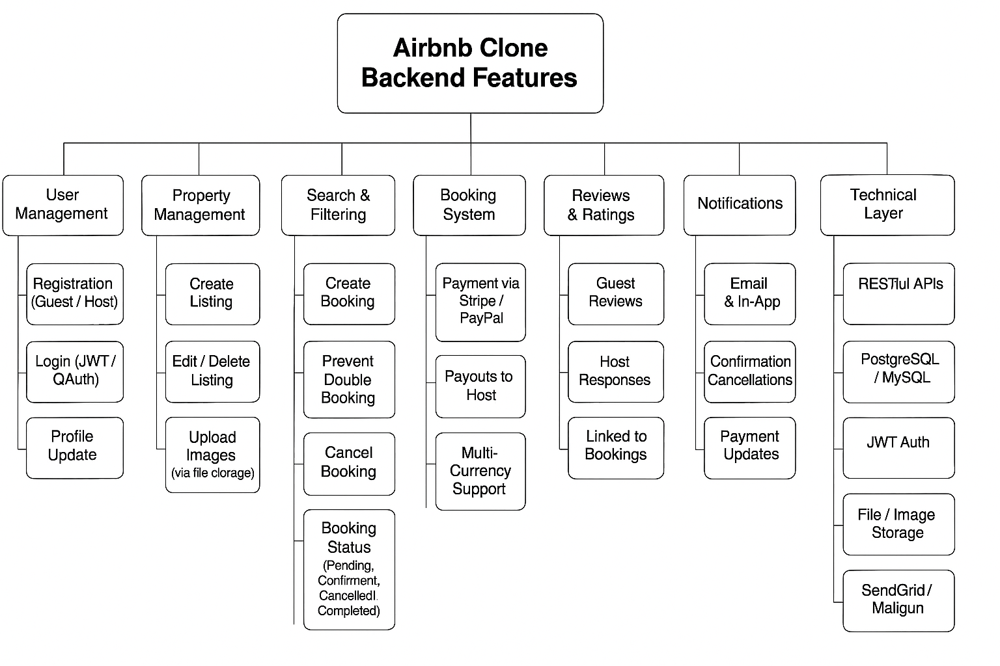

# 📌 Airbnb Clone – Backend Features and Functionalities

This document outlines the **key features and functionalities** supported by the Airbnb Clone backend system. The features are grouped into logical modules that define the system's behavior and flow.

## 🧩 Feature Categories

1. **User Management**
   - Secure Registration and Login (JWT, OAuth)
   - Profile management and role-based access

2. **Property Listings**
   - Hosts can add, edit, and delete property listings
   - Upload images and manage availability

3. **Search and Filters**
   - Search by location, price range, guest capacity, amenities
   - Supports pagination for large datasets

4. **Booking System**
   - Guests can book available properties
   - Handles cancellations and booking status tracking

5. **Payments**
   - Integrated with Stripe/PayPal
   - Manages guest payments and host payouts
   - Supports multiple currencies

6. **Reviews and Ratings**
   - Guests can submit reviews for booked properties
   - Hosts can respond to feedback

7. **Notifications**
   - Email and in-app notifications for bookings and payments

8. **Admin Panel**
   - Admins can manage users, properties, bookings, and payments

9. **Technical Stack**
   - RESTful APIs, JWT auth, PostgreSQL/MySQL
   - Error handling, image storage, third-party services (SendGrid, Cloudinary)

## 🖼️ Visual Overview

Below is a diagram representing the backend feature architecture:

This overview serves as the foundation for designing the backend system, aligning development with clear functionality targets.
