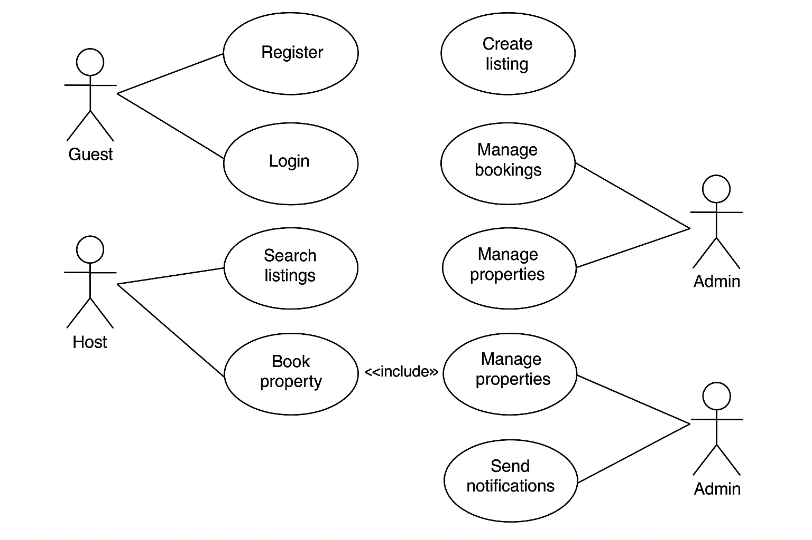

# 📌 Airbnb Clone – Use Case Diagram

## 🎯 Objective
This document visualizes how different types of users interact with the Airbnb Clone backend system. The **use case diagram** illustrates the core interactions between **Guests**, **Hosts**, and **Admins** with key backend functionalities.

## 🧑‍💻 Actors & Their Interactions

### 👤 Guest
- Register
- Login
- Search listings
- Book property

### 🧑‍🏫 Host
- Register / Login
- Create listings
- Manage properties
- Manage bookings

### 👨‍💼 Admin
- Manage users
- Manage properties
- Manage bookings
- Send notifications

## 🧩 Use Case Coverage
The diagram captures the following backend functionalities:
- User authentication and registration
- Property creation and management
- Booking flow with validation
- Admin-level control for moderation
- System-triggered notifications

## 📷 Diagram Overview

The diagram below represents the full system interaction logic:

## 📁 File Structure
